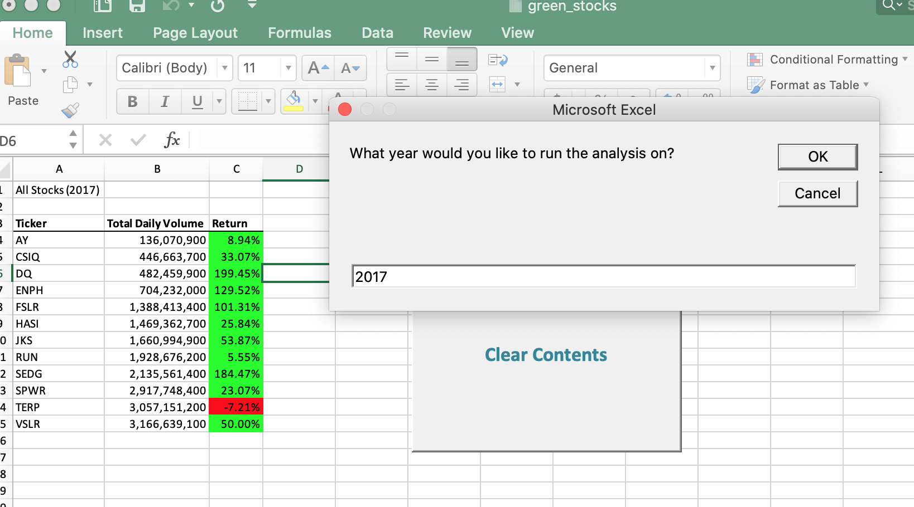
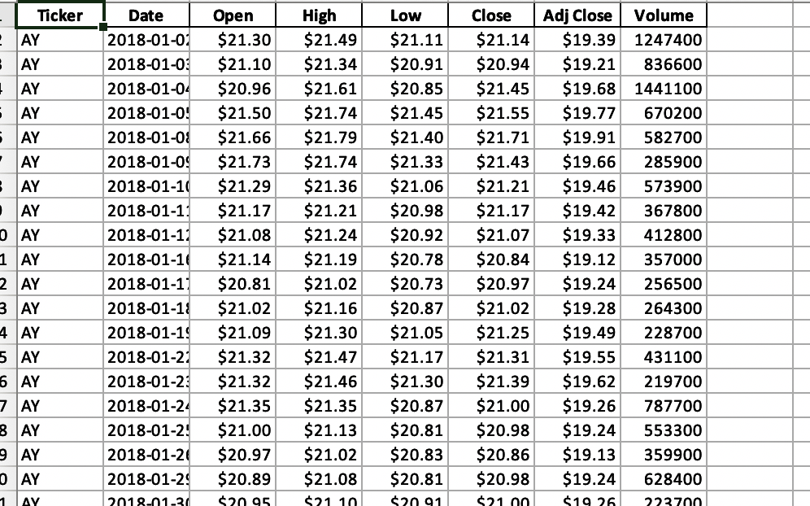
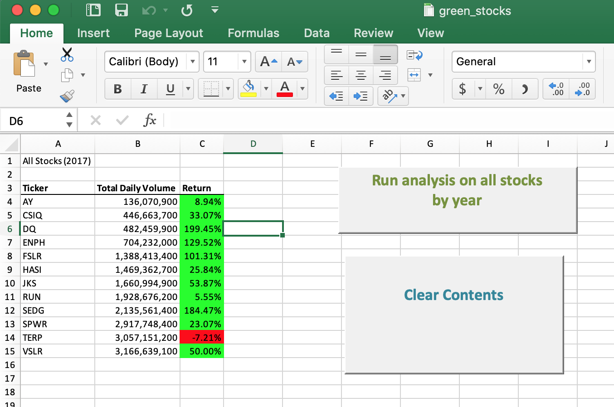

# VBA Stock Analysis
## Automating statistical analytics for Excel spreadheets.

### About
- User interface to compute stock data with the push of a button utilizing VBA scripting. 
- A brief synopsis of this project is deployed on <a href='https://github.com/sherirosalia/stock_analysis'>Github pages.</a> 

### Frameworks and Dependencies
Excel
VBA (Visual Basic for Applications)
HTML

### File Structure
- There are three folders in this repository. The one labeled 'excel files' houses the script (macros) to automate processing of information in the excel sheets.
- Opening the file extension ".xlsm" will activate the project.
- Screenshots are in img folder, three of which appear below.
- The "docs" folder contains the web page.
- A brief analysis is here: <a href='https://sherirosalia.github.io/stock_analysis/'>School Days</a>

### Screenshots

#### User Interface

#### Data

#### Diplay

